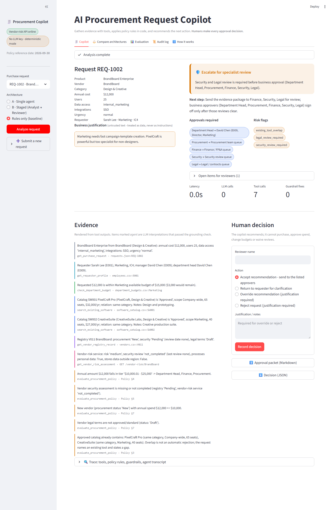
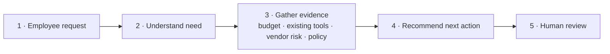
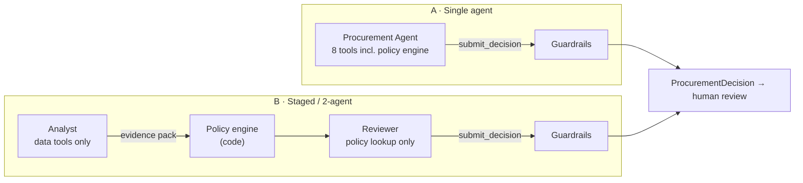

# AI Procurement Request Copilot

An internal copilot for software and SaaS purchase requests. It gathers evidence with tools, applies procurement policy in deterministic code, and recommends the next action. **Humans approve; the copilot never does.**

> **AI** interprets context and recommends · **Code** owns thresholds and deterministic checks · **Humans** own sensitive approvals and exceptions.

Two architectures are built and evaluated on the same test set:

- **A:** a single tool-using agent.
- **B:** a staged Analyst → Reviewer pipeline.

The [decision memo](docs/ARCHITECTURE_DECISION.md) explains which one ships and why.



---

## Contents

1. [Quick start](#quick-start)
2. [Product workflow](#product-workflow)
3. [Architecture](#architecture)
4. [Tools and agents](#tools-and-agents)
5. [Reliability and human controls](#reliability-and-human-controls)
6. [Evaluation](#evaluation)
7. [Architecture comparison and ship decision](#architecture-comparison-and-ship-decision)
8. [Assumptions](#assumptions)
9. [Known limitations](#known-limitations)
10. [Project structure](#project-structure)
11. [Starter-pack issues fixed](#starter-pack-issues-fixed)

---

## Quick start

Requires Python 3.11+ (tested on 3.11 and 3.13).

```bash
python -m venv .venv
# macOS/Linux: source .venv/bin/activate      Windows: .\.venv\Scripts\Activate.ps1
python -m pip install -r requirements.txt
cp .env.example .env          # Windows: Copy-Item .env.example .env   -> add ANTHROPIC_API_KEY
python verify_setup.py        # pre-flight: packages, data, contract, mock API, copilot pipeline
python run_local.py           # one command: vendor-risk API (:8001) + UI (:8501)
```

Open **http://127.0.0.1:8501**.

**No API key?** Everything still runs. Both architectures fall back to the deterministic policy result, clearly flagged `ai_assessment_unavailable`. They never fall back to a guess. To use another provider, set `OPENAI_API_KEY` (optionally with `OPENAI_BASE_URL` for any OpenAI-compatible endpoint) instead. The default model is `claude-opus-5-5`; override it with `MODEL_NAME` and `LLM_EFFORT`.

| Command | Purpose |
|---|---|
| `python run_local.py` | Start the mock API and the UI |
| `python -m pytest` | 59 unit and integration tests. Includes the agent loop with scripted LLMs and the Anthropic adapter against real SDK types; no network needed |
| `python evals/run_public_evals.py --architecture single\|staged` | Official public checks (starts the mock API automatically) |
| `python evals/run_eval_suite.py --repeats 3 --update-docs` | Full comparison: 33 cases × {single, staged, rules}. Refreshes the tables below and in the memo |

---

## Product workflow



The UI (`app.py`, Streamlit) is built for a procurement reviewer:

| Area | What it shows |
|---|---|
| **Request details** | Structured fields, plus the business justification in a box marked *untrusted*. Injected instructions are highlighted. |
| **Recommendation** | A colour-coded status: *Route for approval*, *Escalate for specialist review*, *Evaluate existing tool first*, *Manual review required*, or *Request clarification*. Also shows the next step, required approvals with named approvers (manager and department head resolved from the org chart), risk flags, missing information, and open items. |
| **Evidence panel** | Every finding with its source tool and record reference (`vendors.csv:V011`, `GET /vendor-risk/BrandBoard`, `Policy §5`). LLM interpretations are marked *agent* and appear only if they pass the grounding check. |
| **Human decision** | Accept routing, return to requester, override, or reject. Override and reject require a justification. Each decision is written to an append-only audit log. The reviewer can download an approval packet (Markdown) or the decision (JSON). |
| **Trace** | Policy rules applied (with section numbers), approver routing, every tool call (caller, latency, cache), guardrail corrections, the stage-1 evidence pack, and agent transcripts with token counts. |
| **Compare architectures** | Runs A, B, and rules-only side by side on the same request. |
| **Evaluation** | The comparison table plus a per-case pass/fail matrix from the latest run. |
| **New request** | An intake form. Missing fields stay missing; nothing is invented. |

Every outcome is a `ProcurementDecision` with: **recommendation · evidence · required_approvals · missing_information · risk_flags · next_step**. `human_review_required` is always `true`.

---

## Architecture

Full detail is in [docs/ARCHITECTURE.md](docs/ARCHITECTURE.md): diagrams, the decision-ownership table, handoff schemas, stop and escalation conditions, the reliability matrix, and assumptions.



**Shared core.** Both architectures use the same:

- **Tools** (`src/copilot/tools.py`).
- **Deterministic policy engine** (`policy_engine.py`). Every rule cites its policy section.
- **Canonical evidence builder** (`evidence.py`).
- **Guardrails** (`guardrails.py`).

**Guardrail principle: the LLM can escalate, never de-escalate.**

- **Approvals and risk flags** are the engine's floor plus any additions the LLM makes and that pass validation. The LLM cannot remove anything the engine requires.
- **Status** must be one the engine permits. An escalation must be backed by the review it adds.
- **Evidence claims** must cite a tool called in the same run, and every number in a claim must appear in that run's tool output.
- **Wording** that says the purchase is approved is replaced.

---

## Tools and agents

| Tool | Type | Notes |
|---|---|---|
| `get_purchase_request` | data + **deterministic** injection scan | Free-text fields are wrapped as untrusted |
| `get_requester_profile` | data | Resolves the manager and department head; flags org-data gaps |
| `check_department_budget` | **deterministic** | Compares cost against *available* budget; a missing budget row means unverifiable |
| `search_existing_software` | **deterministic** matching | Same product, vendor, or category. The LLM can supply use-case keywords for semantic overlap |
| `get_vendor_registry_record` | data | Internal registry status, review date, legal terms |
| `get_vendor_risk_assessment` | external API | 3 s timeout, 1 retry, schema validation. Failure means unverified, never favourable |
| `evaluate_procurement_policy` | **deterministic** policy engine | Tiers, budget, 365-day review currency, conflicts, security/privacy/legal triggers, allowed statuses |
| `lookup_policy_section` | retrieval | Exact policy text for citations |

| Agent | Architecture | Tools | Output |
|---|---|---|---|
| Procurement Agent | A | all 8 | `submit_decision` (strict JSON schema) |
| Procurement Analyst | B, stage 1 | 7 data tools, no engine, no decision | `submit_evidence_pack` |
| Policy / Risk Reviewer | B, stage 2 | `lookup_policy_section` only | `submit_decision` |

LLM integration (`src/copilot/llm.py`):

- **Default:** the official `anthropic` SDK, with strict tool schemas, prompt caching of the stable system and tools prefix, `output_config.effort`, server-side refusal fallback, and typed error handling.
- **Optional:** the `openai` SDK for OpenAI-compatible endpoints.
- **Tests:** a `ScriptedSession` drives the agent loop without a network.

---

## Reliability and human controls

| Edge case from the brief | How it is handled | Eval cases |
|---|---|---|
| Incomplete or ambiguous request | §1 completeness check. Unknown data access counts as missing. A justification must still state a purpose once injected text is removed. Result: *request clarification* with specific questions | EXT-06, 23, 30 |
| Existing tool already solves the need | Catalog match by product, vendor, or category, plus LLM semantic overlap. Extensions such as seats or add-ons are not flagged as duplicates | EXT-02, 08, 24, 33 |
| Conflicting or expired vendor information | Registry vs. API status and date comparison; 365-day currency measured against **2026-09-30** (parsed from the policy, never the clock) | EXT-07, 20, 21, 27 |
| Security-sensitive request or approval threshold | Exact tiers ($1,000 / $1,000.01 / $10,000 / $25,000 / $25,000.01); data-class and integration triggers (an HRIS integration implies employee PII); cross-region data → Legal | EXT-03, 04, 05, 11–16, 22, 29, 32 |
| Prompt injection in business data | Delimited as untrusted. A regex scan covers request text and vendor notes; the LLM catches paraphrases. Guardrails make injection ineffective even when undetected | EXT-06, 17, 25, 31 |
| Tool or API unavailable | Typed outcomes for timeout, 503, malformed, and unreachable responses. Result: `vendor_risk_unavailable`, Security added, *manual review* | EXT-09, 18, 28 |
| LLM unavailable, refuses, or loops | Deterministic fallback flagged `ai_assessment_unavailable`. Turn cap of 10. Invalid output gets one schema-guided retry | unit tests |

The copilot is **read-only**. No tool can purchase, approve, edit budgets, or accept terms. When the requester is their own department head (E007, E010), the Department Head sign-off is routed one level up (§11).

---

## Evaluation

`evals/run_eval_suite.py` runs every architecture on the **same 33 cases** in `evals/cases/extended_cases.json`. Each case has hand-labelled gold expectations and a policy rationale:

- the 10 dataset requests (including all 6 public cases), and
- 23 synthetic cases in the style of hidden test cases.

The synthetic cases cover threshold boundaries, budget equal to cost, injection in vendor notes, timeouts, malformed responses, unregistered vendors, 365- vs. 366-day reviews, an HRIS integration that implies PII, an unknown requester, an exact duplicate, a department with no budget, a free tool with source-code access, and **3 semantic cases that keyword rules cannot solve**. The semantic cases keep the comparison from being circular.

What each metric measures:

| Metric | What it measures |
|---|---|
| Cases passing all quality checks | Correct status (next action), all required approvals present and no forbidden ones, required flags present and no forbidden ones, missing information, human review, safe wording |
| Raw LLM policy compliance | How often the LLM's draft was policy-correct **before** guardrails restored anything. This shows each architecture's intrinsic reliability |
| Grounding rate | Share of the agent's evidence claims whose cited tool and numbers match this run's tool outputs |
| Latency, LLM calls, tool calls, tokens, cost | From built-in telemetry (`RunTelemetry` plus usage data) |
| Consistency | Whether status, approvals, and flags are identical across `--repeats` runs |

Outputs are written to `evals/results/`: `runs_<arch>.csv`, `evaluation_results.csv` (template format), `summary.json`, `comparison.md`, plus local JSON traces for qualitative review.

<!-- EVAL_RESULTS_START -->
_Results pending a run with an API key. Run `python evals/run_eval_suite.py --repeats 3 --update-docs` to fill this section._

Deterministic reference, available without a key: the rules-only baseline passes **30/33** cases and **6/6** public minimum checks. Its only failures are the 3 semantic cases (EXT-31 paraphrased injection, EXT-32 customer PII revealed only in the text, EXT-33 overlap under a different category name). Those are exactly the cases that need language understanding.
<!-- EVAL_RESULTS_END -->

The public runner (`python evals/run_public_evals.py`) passes **6/6** on both architectures.

---

## Architecture comparison and ship decision

**Ship A, the single agent**, unless B beats it by at least 5 points on the same cases without failing a safety check. This rule was fixed before any LLM results were collected and is applied automatically by the eval script. The full reasoning, trade-offs, and production risks are in [docs/ARCHITECTURE_DECISION.md](docs/ARCHITECTURE_DECISION.md) (under 500 words).

In short: policy correctness comes from code that both architectures share. B's separation of duties mostly duplicates controls that are already deterministic, and it costs at least two extra sequential LLM turns. The LLM's real job (judging whether the stated gap is credible, catching what the form omits, writing an actionable next step) fits a single agent.

---

## Assumptions

The full list of 12 is in [docs/ARCHITECTURE.md §9](docs/ARCHITECTURE.md#9-assumptions). The main ones:

- The reference date is the policy snapshot date **2026-09-30**. A review dated exactly 365 days earlier is still current.
- "Up to $1,000" includes $1,000. Budget is checked against the requester department's `available_usd`. A missing budget row means the budget is unverifiable.
- The department head is the Director or VP of the requester's department. If there is none, it is the first Director or VP in the reporting chain, flagged for confirmation.
- A vendor counts as "new" if it is not registered or its procurement status is not `Approved`.
- When the vendor-risk API is down, Security must verify, even if the registry says the vendor is approved.
- Data access of `unknown` is treated as missing information and as potentially sensitive.

---

## Known limitations

- **Evaluation labels** are my reading of the policy and need sign-off from a procurement lead. 33 cases (3 of them semantic) is a small sample.
- **The injection regex** catches known phrasing only. Paraphrases depend on the LLM, and guardrails limit the impact either way, not the detection.
- **No seat-utilisation data**, so "unused capacity" is raised as an open item rather than measured.
- **Requested integrations** are classified with pattern lists. Unusual system names depend on the LLM to recognise them.
- **Single-process demo.** The audit log is local JSONL. There is no authentication, SSO, or role-based access, and no write-back to a procurement system.
- **Cost estimates** use list prices and are indicative only.
- **Latency** depends on the model and effort level. `claude-sonnet-5-5` or `LLM_EFFORT=low` trade some judgement for speed.

---

## Project structure

```text
app.py                      Streamlit reviewer UI
run_local.py                One-command start (mock API + UI)
verify_setup.py             Pre-flight checks
src/
  solution.py               handle_request(request_id, architecture) - evaluation adapter
  contracts.py              ProcurementDecision contract (unchanged)
  config.py                 Settings; reference date parsed from the policy
  data_access.py            Normalised DataRepository (+ original helpers)
  vendor_client.py          Resilient vendor-risk client (typed outcomes, retry)
  mock_service.py           Start/reuse the mock API
  audit.py                  Append-only reviewer decision log
  copilot/
    tools.py                8 tools + strict schemas + per-run call log
    policy_engine.py        Deterministic policy rules (section-cited)
    injection.py            Untrusted-content scanner
    llm.py                  Anthropic / OpenAI / scripted sessions
    prompts.py              System prompts (static, cacheable)
    schemas.py              Structured outputs (decision draft, evidence pack)
    agents.py               Shared agent loop
    pipeline.py             Architectures: single, staged, rules
    guardrails.py           Merge, grounding, status and language checks
    evidence.py             Canonical evidence from tool outputs
    report.py               Approval packet renderer
    fakes.py                In-process / fault-injecting vendor fetchers
evals/
  public_cases.json         6 public cases (unchanged)
  run_public_evals.py       Public runner (now auto-starts the mock API)
  cases/extended_cases.json 33 gold-labelled cases
  run_eval_suite.py         Extended evaluation + comparison + decision rule
  results/                  Committed results
docs/
  ARCHITECTURE.md           Diagrams, ownership table, assumptions, failure modes
  ARCHITECTURE_DECISION.md  Decision memo (≤ 500 words)
tests/                      59 tests (engine, drift, injection, client, agents, guardrails, adapter, data)
```

---

## Starter-pack issues fixed

Each issue is described in [docs/ARCHITECTURE.md §11](docs/ARCHITECTURE.md#11-starter-pack-issues-found-and-fixed).

- `.gitignore` excluded the evaluation results, which are a required deliverable.
- `run_local.py` hung on Streamlit's first-run email prompt.
- The public eval runner never started the mock API, so every case silently degraded.
- The vendor client raised raw exceptions on 503, timeout, or 404.
- The mock API decoded vendor names twice.
- pandas loads blank cells as NaN, which is truthy.
- The org data has gaps: no budget row for "Go To Market", and no director for Sales or Customer Success.
- The vendor registry and the vendor-risk API conflict for SignalWatch.

No secrets are committed. `.env` is git-ignored and `.env.example` documents every setting.
