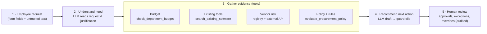
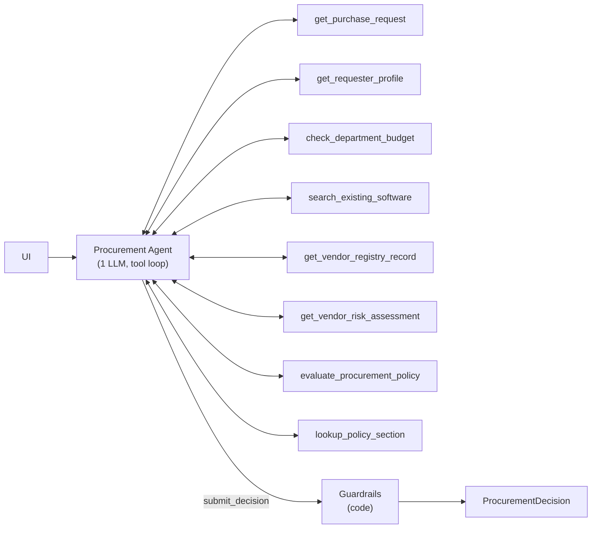
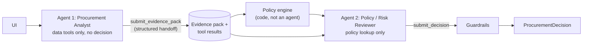

# Architecture & Workflow

> Design principle: **AI interprets and recommends · Code decides thresholds and deterministic checks · Humans approve.**

## 1. End-to-end workflow

Every request ends with a `ProcurementDecision`: **recommendation · evidence · required approvals · missing information · risk flags · next step**, with `human_review_required = true` always (policy §11).

## 2. The two architectures

Both share the same tools, deterministic policy engine, evidence builder and guardrails. Only the agent topology differs, so the evaluation isolates the effect of the architecture.

### A · Single-agent baseline

One agent gathers evidence (parallel tool calls), runs the policy engine as a tool, and submits a structured draft via the `submit_decision` tool (strict JSON schema). Typical run: 3–5 LLM turns.

### B · Staged / two-agent variant

The Analyst cannot decide; the Reviewer cannot fetch business data and must work from the structured handoff plus the binding engine output. The deterministic engine sits **between** the agents as code.

### Rules-only baseline / fallback

The same pipeline with no LLM: canonical evidence + engine result + templated wording. It is (a) a control row in the evaluation and (b) the automatic fallback when the LLM is unavailable, refuses, times out, or never submits a valid result — always flagged `ai_assessment_unavailable`, never presented as an AI judgement.

## 3. Tools

| Tool | Kind | Source | Failure behaviour |
|---|---|---|---|
| `get_purchase_request` | data + deterministic injection scan | `requests.json` | unknown id → clarification decision |
| `get_requester_profile` | data | `employees.csv` | unknown employee → missing information; resolves manager & department head, flags org-data inconsistencies |
| `check_department_budget` | **deterministic** calculation | `department_budgets.csv` | no budget row → `budget_unverifiable` (never assumed sufficient) |
| `search_existing_software` | **deterministic** matching (+ LLM-supplied use-case keywords) | `software_catalog.csv`, `purchase_history.csv` | — |
| `get_vendor_registry_record` | data | `vendors.csv` | not registered → treated as new vendor, no approved terms |
| `get_vendor_risk_assessment` | external API | mock vendor-risk service | 3 s timeout, 1 retry on 5xx/network, 404 not retried, schema-validated; any failure → `vendor_risk_unavailable` + Security, never favourable |
| `evaluate_procurement_policy` | **deterministic** policy engine | `policy_engine.py` | — |
| `lookup_policy_section` | retrieval | `procurement_policy.md` | — |

Every call is logged in a per-run `ToolContext` (args, caller, latency, cache hit, output). That log drives telemetry, the evidence panel and the grounding check.

## 4. Who decides what

| Decision | Owner | Why |
|---|---|---|
| Approval tier from annual cost (§4) | Code | Exact thresholds incl. boundaries ($1,000 / $1,000.01 / $25,000.01) |
| Budget fit (§2) | Code | Arithmetic against *available* budget |
| Review currency (§5) | Code | 365 days vs the policy reference date **2026-09-30** parsed from the policy file — never the machine clock |
| Registry ↔ API conflicts (§5) | Code | Surface, never silently pick a source |
| Security / Privacy / Legal triggers (§5–7) | Code (floor) + LLM (may add) | Data classes, integrations, new-vendor spend, terms, cross-region |
| Required information (§1) | Code | Missing/unknown fields; justification must still state a purpose once injected text is removed |
| Injection detection (§9) | Code scan + LLM | Regex catches known patterns; the LLM catches paraphrases (EXT-31) |
| Is the stated gap vs. existing tools credible? (§3) | **LLM** | Requires reading the justification against catalog notes |
| Does the text reveal data the form didn't declare? | **LLM** | e.g. "import our customer contact list" with `internal_marketing` (EXT-32) |
| Semantic overlap across category names | **LLM** | e.g. "dashboards" vs MetricLoop "Analytics / BI" (EXT-33) |
| Recommendation wording, clarification questions, next step | **LLM** (templated fallback) | Actionable narrative for reviewers |
| Every approval, exception, override | **Human** | Copilot cannot purchase, approve, change budgets or waive reviews (§11) |

## 5. Guardrails (the LLM can escalate, never de-escalate)

1. **Approvals & flags** = engine floor ∪ validated LLM additions. Omissions are restored and counted (`raw_llm_policy_compliance` metric).
2. **Status** must be one the engine allows; an LLM may choose a *more conservative* status (escalate, clarify, manual review, redirect when it reports overlap) but an escalation must be backed by the specialist approval it adds, and `ROUTE` is upgraded to `ESCALATE` if any specialist review applies.
3. **Grounding check**: each LLM evidence claim must cite a tool called in this run, and every number in it must appear in that run's tool outputs; otherwise it is dropped and reported.
4. **Language check**: recommendations/next steps claiming the purchase is approved or needs no review are replaced with deterministic wording.
5. **Untrusted data** is wrapped in `<untrusted_business_data>` tags in every prompt/tool result; prompts state it is data.
6. `human_review_required` is always `true`; no tool can write, purchase or approve.

## 6. Handoff formats

- **Agent → guardrails** (`submit_decision`, strict schema): `status`, `recommendation`, `rationale`, `evidence[{source, finding, reference}]`, `required_approvals`, `risk_flags`, `missing_information`, `clarification_questions`, `overlap_disposition`, `next_step`, `prompt_injection_observed`.
- **Analyst → Reviewer** (`submit_evidence_pack`, strict schema): `need_summary`, `facts[{source, finding, reference}]`, `overlap_assessment{disposition, existing_options, reasoning}`, `data_quality_issues`, `open_questions`, `prompt_injection_observed`, `injection_details`.
- Schemas are Pydantic models (`src/copilot/schemas.py`) converted to strict tool schemas; invalid submissions are returned to the model with the validation errors for one retry.

## 7. Stop & escalation conditions

| Condition | Result |
|---|---|
| Required information missing (§1) | `REQUEST_CLARIFICATION` + specific questions |
| Vendor-risk unavailable / malformed / timeout, registry↔API conflict, budget unverifiable | `MANUAL_REVIEW_REQUIRED` |
| Security / Privacy / Legal / budget-exception triggered | `ESCALATE_SPECIALIST_REVIEW` (business approvers sign after reviews clear) |
| Exact duplicate, or overlap with no stated gap | `REDIRECT_TO_EXISTING_TOOL` |
| Only business approvals triggered | `ROUTE_FOR_APPROVAL` |
| LLM error, refusal, > `MAX_AGENT_TURNS` (10), no valid submission | Deterministic fallback + `ai_assessment_unavailable` |
| Requester is their own department head | Open item: route Department Head sign-off one level up (§11) |

## 8. Reliability matrix

| Failure | Handling | Tested by |
|---|---|---|
| Vendor API 503 / timeout / malformed / unreachable | `vendor_risk_unavailable`, Security added, manual review | `test_outage_never_infers_favourable_status`, EXT-09/18/28 |
| Vendor unknown to registry and API (404) | new vendor: Security + Legal | EXT-19, EXT-29 |
| Stale or conflicting vendor data | `vendor_review_expired`, `conflicting_vendor_evidence` | EXT-07/20/21/27 |
| Injection in request text or vendor notes | flagged, ignored, cannot remove approvals | EXT-06/17/25/31, `test_guardrails_neutralise_a_compromised_agent` |
| LLM omits approvals / claims approval / invents numbers | restored / blocked / dropped | `tests/test_agents_and_guardrails.py` |
| LLM provider down, refusal, bad request | typed `LLMUnavailable` → fallback; strict/fallback features degraded once on 400 | `tests/test_anthropic_adapter.py` |
| Tool raises an exception | returned to the agent as an error result, logged, run continues | `ToolContext.call` |

## 9. Assumptions

1. **Reference date** for all date checks is the policy's snapshot date (2026-09-30), parsed from `procurement_policy.md`.
2. A review dated exactly 365 days before the reference date is still current ("current for 365 days"); 366 days is expired.
3. "Up to $1,000" is inclusive; tiers use the request's annual cost as the annualised amount.
4. Budget is checked against the **requester's** department `available_usd`; a missing budget row is unverifiable, not sufficient.
5. **Department head** = the Director/VP of the requester's department; if none exists (Sales, Customer Success), the first Director/VP in the reporting chain, flagged for confirmation.
6. A vendor is "new" for §7 when its registry `procurement_status` is not `Approved` or it is not registered at all.
7. A vendor-risk outage requires Security verification even for registry-approved vendors (§10: never infer a favourable status).
8. `unknown` data access is treated as missing information **and** as potentially sensitive (Security review).
9. Privacy is required for PII (declared or implied by an HR/CRM/helpdesk integration) or when the vendor confirms out-of-region storage and sensitive data may be involved; unverifiable residency is an open item for Privacy.
10. Requests extending an existing product (add-on / seats / upgrade / training) are not duplicate purchases; overlap with other tools in the same category is only flagged for genuinely new products.
11. Requested integrations given as an empty list mean "none"; a missing field means "not provided".
12. CFO is not in the employee directory, so CFO approval routes to the Office of the CFO queue.

## 10. What I intentionally did not build

- **No autonomous actions**: no purchase, approval, budget or ticket-writing tools — the copilot is read-only by design.
- **No vector store / RAG**: the policy is ~1 page and the catalog 10 rows; deterministic search + section lookup is more reliable and auditable.
- **No third agent or agent framework**: the brief caps at two agents and the evaluation shows the extra stage must earn its cost.
- **No authentication / multi-tenant persistence**: the audit log is a local append-only JSONL file.
- **No seat-utilisation analysis**: the data does not contain usage; it is surfaced as an open item instead of guessed.

## 11. Starter-pack issues found and fixed

| Issue | Impact | Fix |
|---|---|---|
| `.gitignore` excluded `evals/results_*.csv` | Required evaluation results would never reach the repo | Results go to `evals/results/` and are committed |
| `run_local.py` launched Streamlit without `--server.headless` | First run blocks on an e-mail prompt | Port pre-check, reuse of a running API; the UI is now a FastAPI web app, so the prompt no longer exists |
| `evals/run_public_evals.py` did not start the mock API | Every case silently degraded to "vendor unavailable"; PUB-01 fails | Runner starts/reuses the API (`src/mock_service.py`) |
| `vendor_client.get_vendor_risk` raised raw exceptions | 503/timeout/404 crash the tool; no retry, no schema validation | `VendorRiskClient` returns typed outcomes with bounded retry |
| `mock_api` unquoted an already-decoded path param; route not path-typed | Vendor names containing `%` corrupted, `/` → 404 | `{vendor_name:path}`, no double decode |
| pandas loads blank cells as `NaN` (truthy) | e.g. a missing `security_review_date` passes `if date:` | `DataRepository` normalises blanks to `None` |
| E007's department "Go To Market" has no budget row; Sales/CS have no director | Naive department-head / budget lookups fail | Reporting-chain resolution + `budget_unverifiable` |
| SignalWatch registry "Approved" (2025-07-01) vs API "expired" | Silent choice would pass an expired vendor | Conflict + expiry surfaced, manual review |
| `app.py` (Streamlit) showed raw JSON and could only analyse fixed IDs | No evidence panel, no human action | Replaced by a reviewer web app (`web/`): inbox, case view, evidence and trace, intake form, human decisions, audit log |
